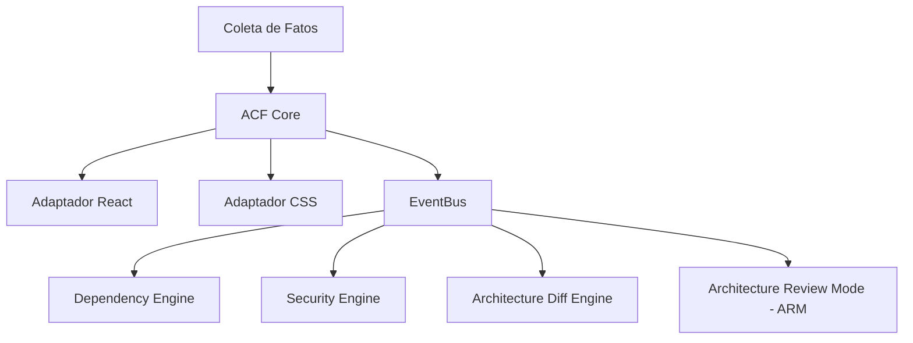

# Documento de Arquitetura de Referência Unificada — EOS v0.4.0

## 1. Visão Geral e Filosofia
O **Engineering Operating System (EOS)** é uma plataforma independente de governança e consistência arquitetural projetada para operar de forma desacoplada das aplicações que audita. Ele atua como um barramento estático e analítico, utilizando adaptadores para traduzir a linguagem de desenvolvimento (React, TypeScript, CSS) em conceitos abstratos de grafos arquiteturais.

---

## 2. Topologia do Sistema (Estrutura de Diretórios)
A distribuição física do EOS está estruturada da seguinte forma:

```
Engineering-Operating-System/
├── EOS/                         # Motores de Execução (Core)
│   ├── core/                    # Princípios, Governança e Regras
│   │   └── platform/            # Motores físicos do OS (ARM, EventBus, Platform Config)
│   ├── acf/                     # Artifact Consistency Framework
│   │   ├── adaptadores/         # Tradutores de AST (React, CSS, etc.)
│   │   └── acf-core.js          # Core do pipeline ACF
│   └── templates/               # Checklists, ADRs e relatórios padrão
├── documentação/                # Manuais, RFCs e especificações técnicas
└── package.json                 # Definição de dependências e scripts de execução
```

No projeto cliente (ex: `Cebus ERP`), o EOS injeta e consome metadados através de:
```
Projeto-Cliente/
└── .eos/
    ├── decisoes/                # Histórico de ADRs e Exceções arquiteturais
    │   ├── decisoes-historico.json
    │   └── exceptions.json
    ├── auditorias/              # Relatórios consolidados gerados em pipelines
    │   ├── acf-auditoria.md
    │   └── auditoria.json
    └── eos.risk.yml             # Mapeamento de camadas e pesos de risco
```

---

## 3. Motores de Execução (Engines)
O pipeline do EOS v0.4.0 é composto por motores autônomos e acoplados via um barramento de eventos (`EventBus`):



1. **Artifact Consistency Framework (ACF)**: Analisa acoplamentos físicos e semânticos (ex: mapeamento entre elementos React e folhas de estilo CSS correspondentes).
2. **Dependency Engine**: Identifica desvios topológicos de acoplamento (ex: injeção de dependência inválida ou violação de Clean Architecture baseada em `dependency-cruiser`).
3. **Security Engine**: Escaneia vulnerabilidades no design (ex: dependências obsoletas ou violação de isolamento de credenciais).
4. **Architecture Diff Engine**: Compara o estado da arquitetura do commit atual com o commit pai, emitindo relatórios de variação estrutural (+/- Nós e Arestas do Grafo).
5. **Architecture Review Mode (ARM-001)**: Intervém no ciclo de vida de alterações com alto Blast Radius ($G \ge 10$), instruindo o arquiteto sobre impactos e registrando pareceres.

---

## 4. Portões de Qualidade (Quality Gates)
O EOS valida e bloqueia o commit através de limiares (Thresholds) programáticos definidos nos metadados:
* **ARQ (Arquitetura)**: Mínimo 80/100 (Avalia conformidade topológica).
* **GOV (Governança)**: Mínimo 90/100 (Avalia documentação de desvios via ADR).
* **TST (Testes)**: Mínimo 90/100 (Avalia cobertura e saúde de suítes de teste).
* **EVO (Evolutabilidade)**: Mínimo 80/100 (Avalia facilidade de manutenção e modularidade).
* **CON (Consistência)**: Mínimo 90/100 (Avalia ausência de arquivos órfãos ou estilos não-vinculados).

Qualquer violação abaixo desses patamares resulta em `exit 1` no pré-push do Git, direcionando o projeto para o estado de **QUARENTENA** na máquina de estados do EOS.
