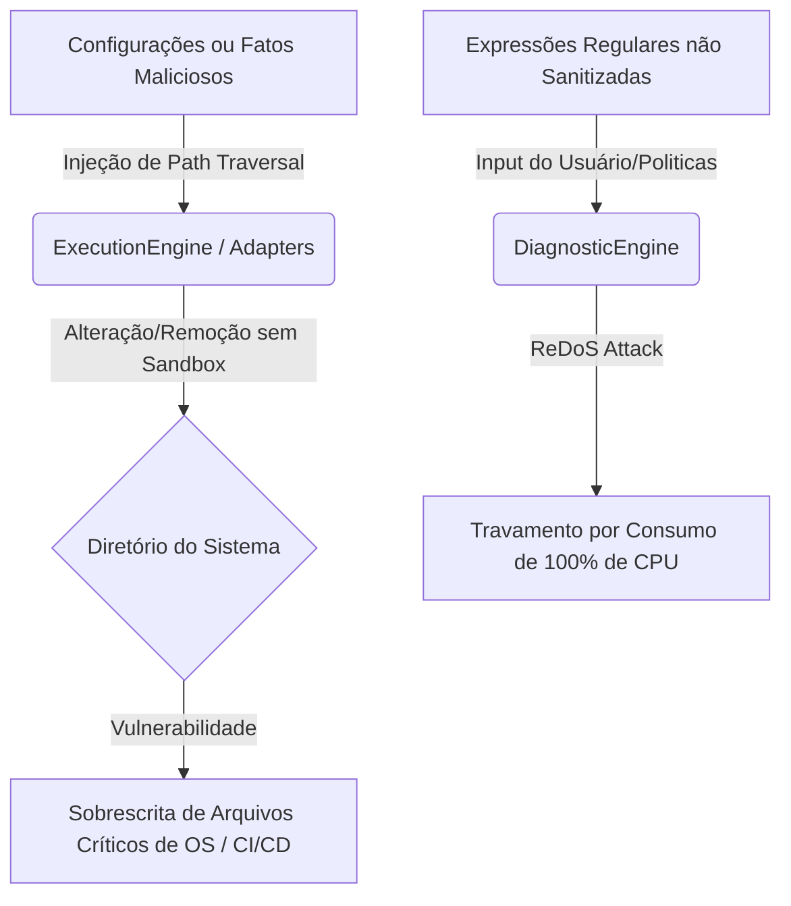

# Análise Crítica e Diagnóstico de Segurança — EOS ACF (v0.5.0)

Este documento apresenta uma revisão crítica arquitetural, uma análise de eficiência e uma avaliação de segurança/vulnerabilidades do **Artifact Consistency Framework (ACF)** do **Engineering Operating System (EOS)**, considerando a evolução recente (v0.5.0) e as oportunidades de amadurecimento para torná-lo uma plataforma de nível de produção.

---

## 1. Avaliação de Convergência (A Crítica vs. Estado Atual)

A análise crítica apresentada pelo arquiteto é altamente precisa e delineia o caminho padrão para frameworks de análise estática maduros. No entanto, é importante notar que a implementação atual da **v0.5.0** já convergiu e resolveu de forma nativa vários dos pontos apontados como "lacunas":

### 1.1 O que já foi endereçado na v0.5.0:
1. **Camada Intermediária (Semantic Graph)**: O `SemanticGraph` (`core/platform/semantic-graph.js`) foi introduzido como um recurso centralizado. As engines de diagnóstico e correlação não lidam com fatos brutos dispersos, mas operam diretamente sobre consultas matemáticas e travessias do Grafo (DFS para ciclos, etc.).
2. **Planner com Entidades Ricas**: O `PlanningEngine` gera instâncias da classe de domínio rica `RefactoringPlan` (em vez de textos brutos ou strings simples). Cada plano encapsula `actions`, `risks` (com severidade e descrição), `rollback` e `confidenceScore`.
3. **Confidence Score Integrado**: A entidade `Inconsistency` e o `DiagnosticEngine` agora possuem suporte a graus de confiança em ponto flutuante (`0.0` a `1.0`), mapeados de acordo com a heurística de cada regra (ex: imports estáticos quebrados têm confiança `0.99`, enquanto classes órfãs têm `0.85` devido a possíveis carregamentos dinâmicos).
4. **Hierarquia de Adaptadores**: O acoplamento foi quebrado com a introdução de uma árvore hierárquica: `BaseAdapter` -> `PresentationAdapter` / `StyleAdapter` -> `ReactAdapter` / `CSSAdapter`.
5. **Knowledge Model Inicial**: O `SemanticGraph` já expõe a API `loadKnowledgeModel`, capaz de mapear arquivos físicos a `Features` e estas a `Domínios`, estabelecendo a base para o Grafo de Conhecimento (Knowledge Graph).

---

## 2. Pontos Fracos Arquiteturais e Gargalos de Eficiência

Embora o ACF tenha evoluído para um modelo de dados DDD robusto, existem limitações técnicas importantes em sua mecânica atual:

### 2.1 Análise Estática Frágil (Baseada em Expressões Regulares)
* **Gargalo**: Os adaptadores `ReactAdapter` e `CSSAdapter` utilizam Regex de forma síncrona para analisar imports e `classNames`.
* **Impacto**: Expressões regulares são inerentemente limitadas para analisar linguagens livres de contexto (context-free grammars). Elementos como interpolações de strings dinâmicas (`className={styles[activeState]}` ou classnames concatenados via bibliotecas como `clsx`), comentários de código ou falsas correspondências textuais geram falsos positivos/negativos frequentes.
* **Eficiência**: Processamento Regex síncrono em arquivos muito grandes bloqueia o loop de eventos do Node.js, degradando o tempo de execução do pipeline em grandes bases de código.

### 2.2 Bloqueio de I/O na Varredura do Sistema de Arquivos
* **Gargalo**: A função `_walk` nos adaptadores é recursiva e síncrona (`fs.readdirSync`, `fs.statSync`, `fs.readFileSync`).
* **Impacto**: Em repositórios de médio a grande porte (dezenas de milhares de arquivos), a varredura síncrona causa travamentos na CPU (CPU-bound) e desperdiça a capacidade de concorrência assíncrona do Node.js.
* **Eficiência**: O tempo de execução cresce linearmente $O(N)$ com o número de arquivos do projeto, inviabilizando o uso como Quality Gate ágil no CI/CD em commits rápidos.

### 2.3 Escalabilidade de Travessia do Grafo Semântico
* **Gargalo**: O algoritmo de detecção de ciclos (`findCycles` no `SemanticGraph`) utiliza busca em profundidade (DFS) recursiva sem limite de profundidade, extraindo e duplicando caminhos na memória.
* **Impacto**: Em grafos altamente conectados ou complexos (com milhares de importações cruzadas), a recursão pode estourar a pilha de chamadas (Stack Overflow) ou consumir volumes excessivos de memória RAM ao rastrear ciclos redundantes.

---

## 3. Análise de Segurança e Exploração de Vulnerabilidades

A integração de motores de refatoração automatizada (`ExecutionEngine`) que alteram arquivos em disco introduz riscos de segurança severos que precisam ser mitigados antes de expor o EOS a ambientes compartilhados ou pipelines de CI/CD corporativos:



### 3.1 Vulnerabilidade de Path Traversal no Execution Engine
* **Vulnerabilidade**: O `ExecutionEngine` e os adaptadores confiam implicitamente na propriedade `target` do `RefactoringPlan` para realizar operações físicas como `fs.renameSync(file, newPath)` ou `fs.writeFileSync`.
* **Cenário de Exploração**: Se um agente malicioso conseguir injetar ou manipular um fato estruturado de inconsistência com um target apontando para fora do workspace (ex: `target: "../../../../../Windows/System32/drivers/etc/hosts"` ou caminhos relativos de configuração de servidores CI/CD como `.github/workflows/deploy.yml`), a execução automática de refatorações modificará ou corromperá arquivos críticos do sistema do desenvolvedor ou da máquina de build.
* **Gravidade**: **Crítica (9.8 CVSS v3.1)**.

### 3.2 Vulnerabilidade de ReDoS (Regular Expression Denial of Service)
* **Vulnerabilidade**: O `DiagnosticEngine` compila padrões regex dinamicamente a partir das políticas configuradas:
  ```javascript
  const patternStr = namingPatterns[type] || namingPatterns.file;
  const regex = new RegExp(patternStr);
  ```
* **Cenário de Exploração**: Se o arquivo de configuração `auditoria.json` (ou regras recebidas remotamente via barramento de integração) for comprometido, um atacante pode injetar uma expressão regular catastrófica (como `^(([a-zA-Z0-9_-])+)+$`). Ao avaliar arquivos com nomes longos e caracteres especiais, a engine entrará em backtracking catastrófico, consumindo 100% da CPU indefinidamente e causando a negação de serviço (DoS) do pipeline de integração.
* **Gravidade**: **Média/Alta (6.5 CVSS v3.1)**.

### 3.3 Ausência de Assinatura e Validação de Integridade nos Fatos
* **Vulnerabilidade**: O barramento do `EventBus` aceita qualquer fato que herde de `Fact`. Não há criptografia, assinatura digital (HMAC) ou camada de validação de autoridade para os fatos publicados.
* **Cenário de Exploração**: Um adaptador de terceiros vulnerável ou um script malicioso rodando localmente pode forjar fatos de alteração sugerida (`acf.change.planned`) com ações arbitrárias e injetá-los no barramento, forçando o EOS a executar mutações destrutivas na base de código durante a fase de Execução automática.
* **Gravidade**: **Alta (8.0 CVSS v3.1)**.

---

## 4. Recomendações de Engenharia para Mitigação

Para elevar o ACF ao patamar de maturidade corporativa, propomos as seguintes ações de correção arquitetônica e de segurança:

### 4.1 Segurança em Primeiro Lugar (Sandboxing & Sanitização)
1. **Sanitização de Caminhos (Anti-Path Traversal)**:
   Antes de qualquer operação de arquivo em disco nos adaptadores e engines, valide e restrinja os caminhos ao diretório raiz do projeto:
   ```javascript
   const safePath = path.resolve(process.cwd(), targetPath);
   if (!safePath.startsWith(process.cwd())) {
     throw new Error(`[Security Alert] Tentativa de acesso fora do workspace: ${targetPath}`);
   }
   ```
2. **Sanitização de Expressões Regulares**:
   Implemente uma biblioteca de validação/limitação de regex (ex: `safe-regex`) ou execute a validação de regras regex dinâmicas sob um timeout de execução estrito para impedir ataques de backtracking (ReDoS).
3. **Controle de Autorização de Escrita**:
   Crie um parâmetro rígido de `dryRun` ativo por padrão. Qualquer alteração real só deve ser executada se o arquivo `.eos/config` tiver uma assinatura explícita do desenvolvedor para autorizar mutações automáticas de código.

### 4.2 Evolução Analítica (Troca de Regex por AST)
* **Recomendação**: Migrar gradativamente a varredura baseada em Regex nos adaptadores para análise baseada em **AST (Abstract Syntax Tree)**.
  * Para o `ReactAdapter`: Utilizar parsers eficientes e leves (como `@babel/parser` ou `acorn`).
  * Para o `CSSAdapter`: Utilizar o `postcss` para navegar pela árvore de regras e seletores de estilo de forma determinística.
* **Benefício**: Reduz a zero os falsos positivos de sintaxe e permite capturar lógicas de concatenação e importação dinâmica com segurança.

### 4.3 Otimização de Performance
* **I/O Assíncrono**: Substituir recursões síncronas por leituras assíncronas utilizando streams ou pacotes altamente otimizados como `fast-glob`, que utilizam chamadas de sistema eficientes em C++ sob o capô do Node.js.
* **Busca Iterativa com Limite de Ciclos**: Modificar o DFS do `findCycles` para usar uma pilha iterativa em vez de recursiva e impor um limite de profundidade máxima de busca (ex: 50 nós de profundidade) ou rastrear ciclos apenas nos pontos de entrada das features de negócios, evitando custos computacionais exponenciais.

---

## 5. Próximo Salto Arquitetural (Roadmap Sugerido)

Com o barramento de fatos e o grafo semântico estruturados, a evolução do EOS deve priorizar:

```
                  ┌───────────────────────────────┐
v0.6 (Atual)      │  Semantic & Knowledge Graph   │ (Consolidação do mapeamento Domínio->Feature)
                  └───────────────┬───────────────┘
                                  │
                  ┌───────────────▼───────────────┐
v0.7              │ AST Parsing & Safe Sandbox    │ (Eliminação de Regex e Traversal Vulnerabilities)
                  └───────────────┬───────────────┘
                                  │
                  ┌───────────────▼───────────────┐
v0.8              │   Architecture Diff Engine    │ (Comparação de grafos entre Commits/Branches)
                  └───────────────┬───────────────┘
                                  │
v1.0 (Produção)   │ Continuous Architecture Gate  │ (Dashboard, CI/CD Plugin e Rules Avançadas)
                  └───────────────────────────────┘
```

Esta análise demonstra que o EOS está na direção certa, tendo implementado os pilares estruturais mais difíceis (Grafo Semântico, Barramento e Entidades de Domínio Ricas). A transição para um modelo com segurança reforçada e análise baseada em AST consolidará a plataforma como referência em governança de arquitetura contínua.
